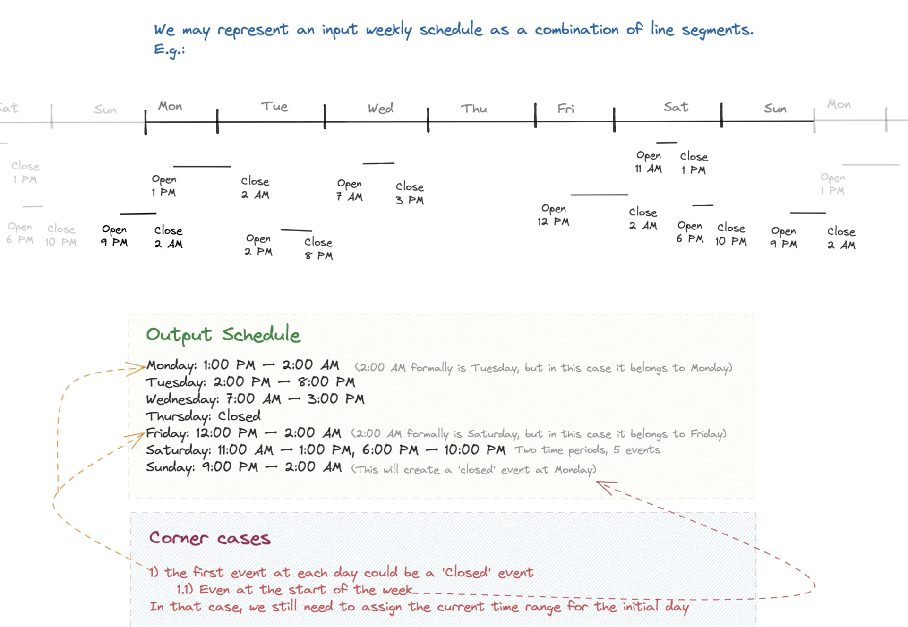
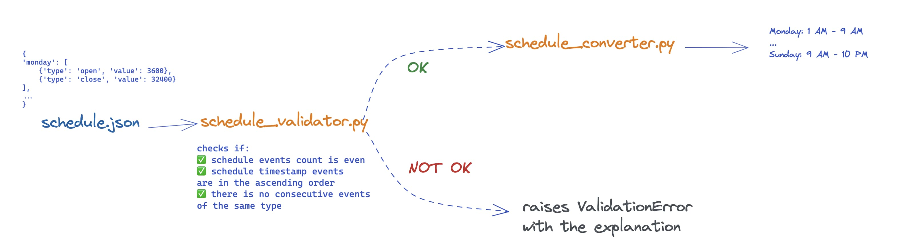

Hi there!

Here is my humble solution to the given problem.

We can represent schedule ranges as a segmented infinite line:

For the validation purposes `schedule_validator.py` module was created in order to validate incoming data.
Also there are some unit tests which covers the main functionality of the schedule_converter.py

Simplified architecture:

From the root folder you can run the following commands:

1) Run the unit tests:

`python3 -m unittest tests/test_schedule_converter.py`

2) Form a schedule from the example in PDF-file:

`python3 -m schedule_converter --file input_samples/test_case_1.json --verbose True`

3) This file `test_case_2.json` will raise a validation error

`python3 -m schedule_converter --file input_samples/test_case_2.json --verbose True`

Please subscribe to my [LinkedIn](https://www.linkedin.com/in/ivantgam/) and ... whoops sorry, wrong line.
Thank you for taking a look :)
